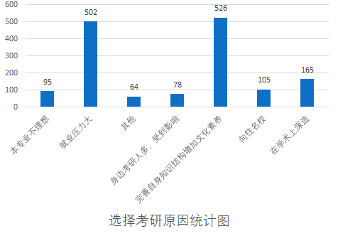
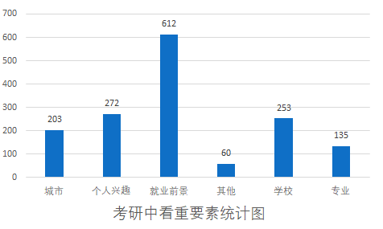

# 报考原因

> #### 大多数人为了提升自身素质
>
> - **完善自身知识结构增加文化素养：** 526 人选择这个选项，这显示了大多数学生看中考研的机会来提升自己的知识结构和文化素养。
>
> #### 学术深造和向往名校也是主要因素
>
> - **在学术上深造：** 165 人选择这个选项，这说明有一部分学生选择考研是为了在学术领域深造。
> - **向往名校：** 105 人选择这个选项，显示一些学生对于名校的向往。
>
> #### 就业压力大是主要原因之一
>
> - **就业压力大：** 502 人选择这个选项，这反映了很多学生考研的原因之一是为了缓解就业压力。

 

> #### 考研主要考虑因素：
>
> **学生最关注的因素是就业前景（40%），其次是个人兴趣（17.8%）和学校（16.7%）。**
>
> - **就业前景：** 610 人选择就业前景，这可能意味着学生普遍认为考研能够提升他们在职场上的竞争力，获得更好的就业机会。
> - **个人兴趣：** 272 人选择个人兴趣，表明一部分学生在选择考研时更注重个人兴趣和爱好，而不仅仅是为了就业。
>
> - **学校：** 只有 253 人选择学校，这可能说明在该校学生中，考研的动机相对较少受到学校因素的影响。
>
> **城市、专业和其他因素相对较少被选择。**
>
> - **专业：** 135 人选择专业，相对来说，专业并不是学生们选择考研的主要因素。
>
> - **城市：** 203 人选择城市，这可能反映了一部分学生在选择考研时关注城市的发展前景或者生活质量。
