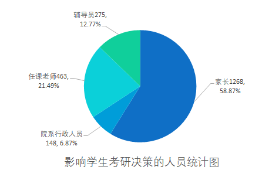

# 影响因素

> ####  任课老师和辅导员的影响较大
>
> - **任课老师：** 463人选择了任课老师，可能说明老师在学生的职业规划和考研动机中发挥了重要的指导和影响作用。
> - **辅导员：** 276人选择了辅导员，同样表明辅导员在学生决定考研时也有一定的影响力。
>
> ####  家长的影响较为显著
>
> - **家长：** 1268人选择了家长，这可能反映了在中国文化中，家长在子女教育和职业规划中的决策权较大。