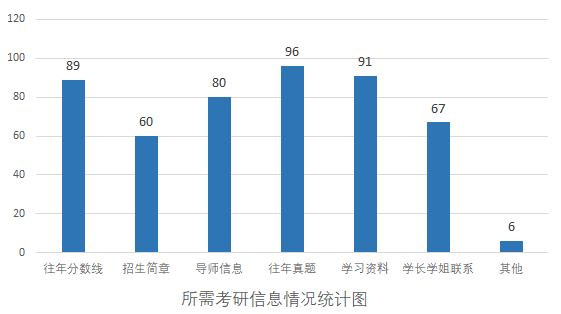

# 信息获取途径

> - **往年分数线（89）：** 这些同学可能对往年分数线感兴趣，以了解往届录取分数水平，从而更好地评估自己的竞争力，作为制定复习计划和报考学校的参考依据。
> - **招生简章（60）：** 招生简章提供了关于招生计划、录取条件、培养方案等重要信息。选择这个选项的同学可能希望深入了解自己心仪学校的具体要求，以更好地准备申请材料和笔试。
> - **导师信息（80）：** 考生关注导师信息可能是因为在研究生阶段导师选择对于学术发展和研究方向至关重要。了解导师的研究方向、团队氛围等信息，有助于考生做出更明智的选择。
> - **往年真题（96）：** 往年真题是备考中非常重要的资源，通过分析过去的考题，考生能够更好地了解考试内容和难度，有助于有针对性地进行复习。
> - **学习资料（91）：** 学习资料包括课程资料、参考书籍等，这些对于备考也是至关重要的。考生可能需要全面、及时地获取相关学习资料，以保证自己在备考过程中不会因为信息匮乏而受到限制。
> - **学长学姐联系方式（67）：** 与学长学姐联系可以获取一手的考研经验和建议，包括复习方法、备考心得等。这种信息交流有助于新生更好地应对备考阶段的各种挑战。
> - **其他（6位选择）：** 具体的“其他”原因没有提供具体信息，可能包括一些特殊需求或者考生关心的信息，需要进一步了解