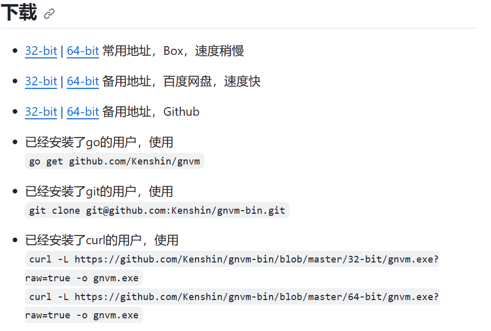

# GNVM-Node.js 多版本管理器


## 1.GNVM介绍

[GNVM](https://github.com/kenshin/gnvm)这个东西的不如 T 好看，没有 NVM 适配的环境多，但是它**适配 Windows而且不用删除原有node**[绝杀]，当然它也有它的优势，不依赖任何环境，无需配置，多线程下载，内置 TAOBAO。


## 2.下载

上方蓝字，点击进入GNVM的GitHub页面找到下面这里



按照自己的情况下载即可，下载后是一个exe格式的文件，将其放到Node的安装目录下，与node.exe同级。


## 3.使用

> [!TIP|style:flat]
>
> 使用cmd时，要以**管理员身份运行**，否则权限不够

使用cmd查看使用`gnvm version`命令，出现`版本说明`则代表成功。

使用下面命令将镜像源切成淘宝源

```
gnvm config registry TAOBAO
```


## 4.常用命令

### 1.node版本信息

这里可以获取到node所需的npm版本

```
gnvm search node版本号
```


### 2.node下载

```
gnvm install node版本号
```


### 3.本地安装过的node列表

```
gnvm ls
```


### 4.node版本切换

```
gnvm use node版本号
```


### 5.npm安装

```
gnvm npm npm版本号
```


### 6.node删除

不用常清，不占多少内存

```
gnvm uninstall node版本号
```


### 7.node更新

感觉除非报错了，或者太久了，其他似乎没必要升级 

```
gnvm update latest
```

