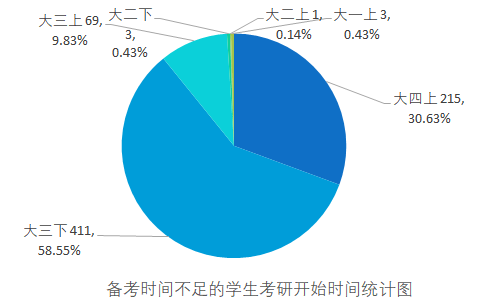

# 考研时间节点

> ### 决定考研的时间节点分布：
>
> - 大三是考研决策的高峰期，有868人在大三决定要考研。
> - 大四的决策人数也相对较多，有380人在大四决定考研。
> - 大一和大二的决策人数相对较少，分别为196人和88人。

> ### 考研开始复习节点人数分布：
>
> - 大三下是复习考研的主要起点，有920人在这个阶段开始准备。
> - 大四上也有415人在这个时候开始复习考研。
> - 大多数考生在大三下和大四上开始复习考研，这与考研需要长时间的系统准备有关。
> - 选择备考时间不足的学生中，大三下的人数最多，随着考研压力的加大，越早准备，获取信息和准备时间越充足，能够更好地应对激烈的竞争。

> ### 备考时间不足的学生情况：
>
> - 大多数选择备考时间不足的学生开始复习考研的时间集中在大四上和大三下，分别占总人数的 30.6% 和 58.54%。这表明这部分学生感到在最后两个学期的备考时间不足。
> - 仅有少数学生在大三上或大二,大一就开始备考，对其数据进行抽样分析，发现其多数为专业必须进行考研，或是通过线下询问得知其对自身职业规划较早开始，所以提前规划了考研复习。

> ### 未选择备考时间不足的学生：
>
> - 未选择备考时间不足的学生开始复习考研的时间仍存在差异。大部分学生在大四上和大三下开始备考，与选择备考时间不足的学生一致，这客观反应了大三下与大四上是开始备战考研的时间点。