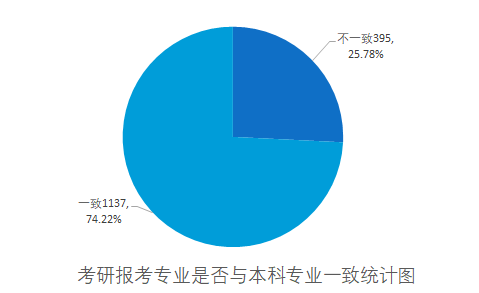
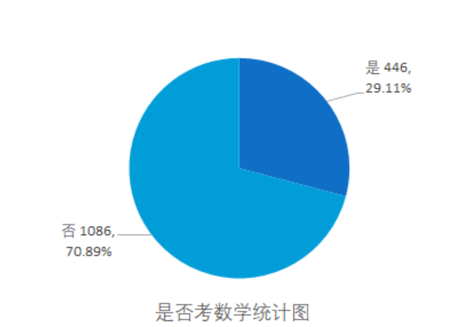
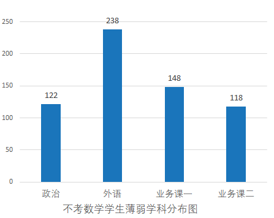
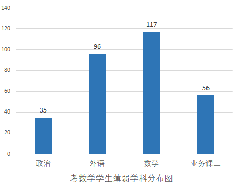

# 薄弱学科与跨专业报考

> ### 考研报考专业与本科专业一致：
>
> - 1137人报考专业与本科专业一致，而395人报考专业与本科专业不一致。

针对考研科目薄弱，由于考研学生主要存在差异在于是否要考高等数学，对结果存在较大的影响，故将学生分为是否考数学两类

> ### 是否考数学
>
> 是：有446名同学选择了是
>
> 否：有1086名同学选择了否

> - **政治 :**  122人选择了政治，反映了学生中一部分在政治科目上存在较大的困难。
> - **外语 :**  238人选择了外语，外语困难意味着这部分学生需要额外的英语学习支持。
> - **业务课一 :**  148人选择了业务课一，这部分学生在专业基础科目上可能有所不足，需要更多的学习支持。
> - **业务课二 :**  118人选择了业务课二，业务课二的困难可能涉及到专业课程，需要特定领域的学习或加强

> - **政治：** 35人选择了政治，这可能是因为他们认为政治是自己备考的薄弱科目之一。
> - **外语：** 96人选择了外语，表明在考数学的学生中，有相当数量的人认为外语是弱势科目。
> - **数学：** 117人选择了数学，这个数据较高，可能反映了一部分考数学的学生在数学方面存在一定的困难。
> - **业务课二：** 56人选择了业务课二，这也是一部分学生认为自己较为薄弱的科目之一 