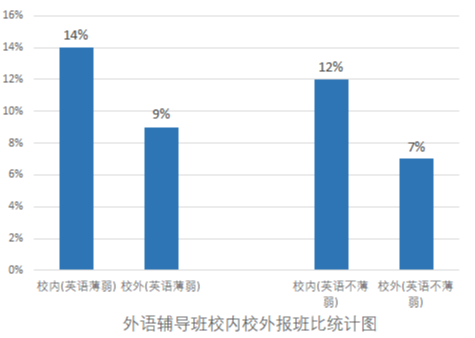
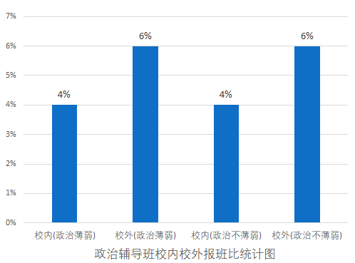
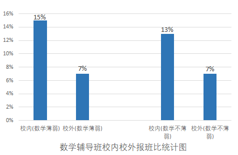
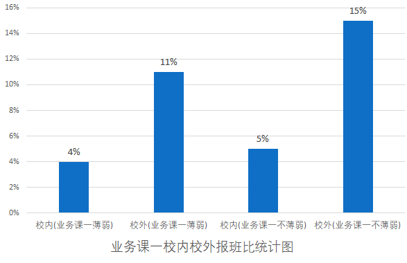
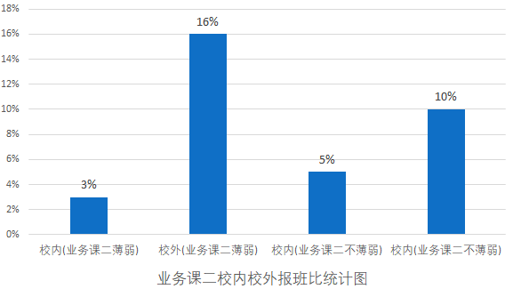

# 辅导班信息

> **外语薄弱的同学（共334人）：**
>
> - 在这334名外语薄弱的学生中，有48人选择了校内辅导班，占比约为14%。
> - 同时，31人选择了校外辅导班，占比约为9%。
>
> **外语不薄弱的同学（共1198人）：**
>
> - 在这1198名英语不薄弱的学生中，有147人选择了校内辅导班，占比约为12%。
> - 同时，82人选择了校外辅导班，占比约为7%。

> **政治薄弱的学生（共158人）：**
>
> - 在校内辅导班报班的人数为6，占政治薄弱学生总数的4%。
> - 在校外辅导班报班的人数为9，占政治薄弱学生总数的6%。
>
> **政治不薄弱的学生（共1374人）：**
>
> - 在校内辅导班报班的人数为51，占政治不薄弱学生总数的4%。
> - 在校外辅导班报班的人数为76，占政治不薄弱学生总数的6%

> **数学薄弱的学生(118人)：**
>
> - 校内辅导班报班人数为18，占数学薄弱学生总数的15%。
> - 校外辅导班报班人数为8，占数学薄弱学生总数的7%。
>
> **数学不薄弱的学生(328人)：**
>
> - 校内辅导班报班人数为43，占数学不薄弱学生总数的13%。
> - 校外辅导班报班人数为22，占数学不薄弱学生总数的7%。

> #### 专业课一(不含高数)薄弱学生(149人）：
>
> - **校内报班人数：** 6人，占专业课一薄弱学生总数的4%。
> - **校外报班人数：** 17人，占专业课一薄弱学生总数的11%。
>
> #### 专业课一(不含高数)不薄弱学生（837人）：
>
> - **校内报班人数：** 38人，占专业课一不薄弱学生总数的5%。
> - **校外报班人数：** 128人，占专业课一不薄弱学生总数的15%。

> - **业务课二薄弱的学生（175人）：**
>
>   - 校内辅导班报班人数为6人，占比3%。
>
>   - 校外辅导班报班人数为28人，占比16%。
>
> - **业务课二不薄弱的学生（1357人）：**
>
>   - 校内辅导班报班人数为67人，占比5%。
>
>   - 校外辅导班报班人数为137人，占比10%