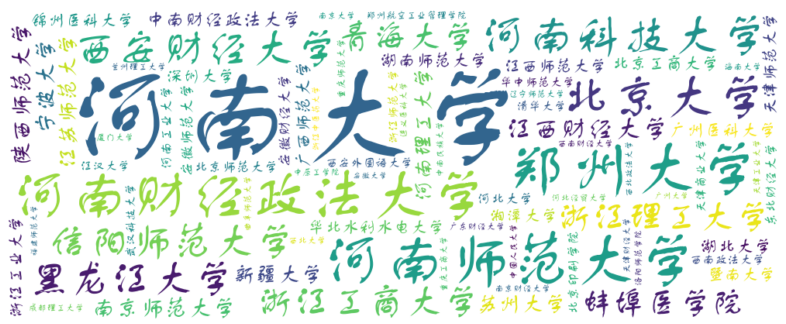
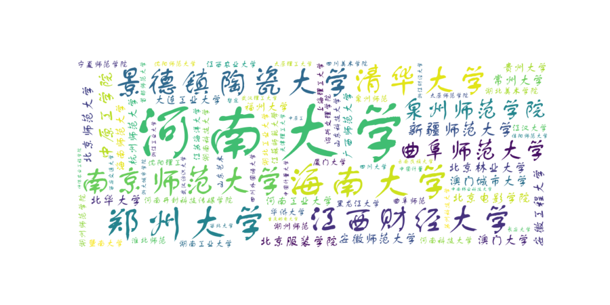
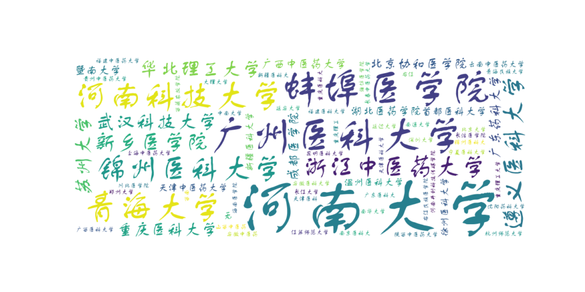
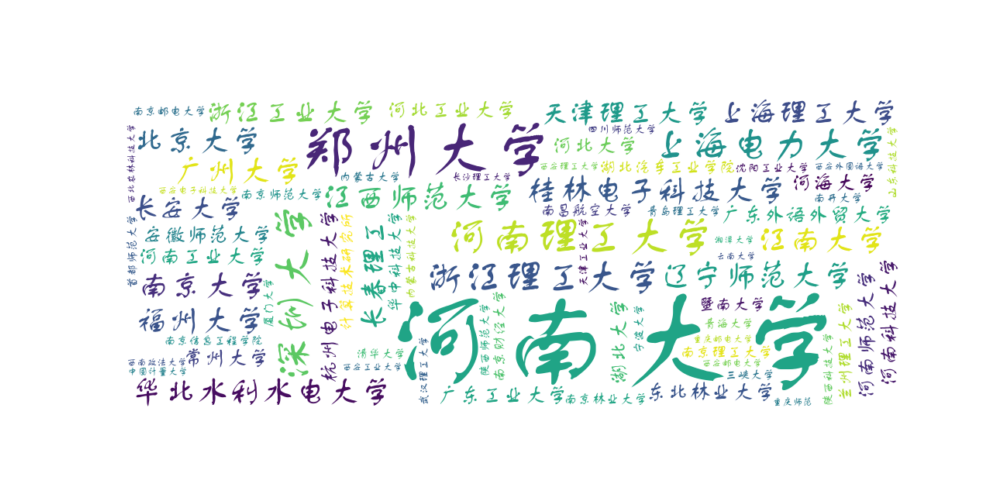
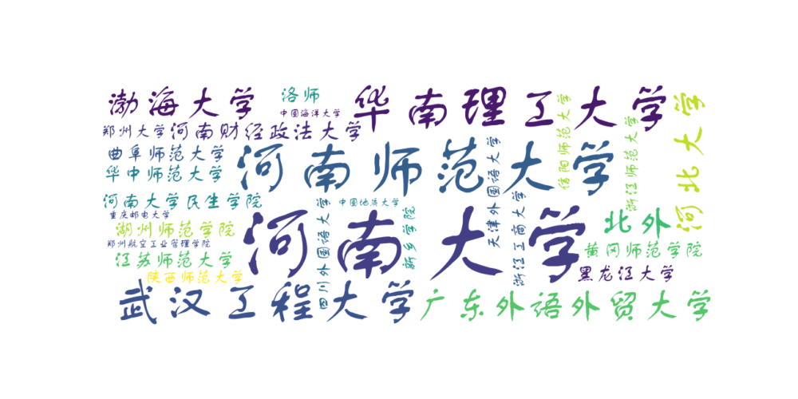
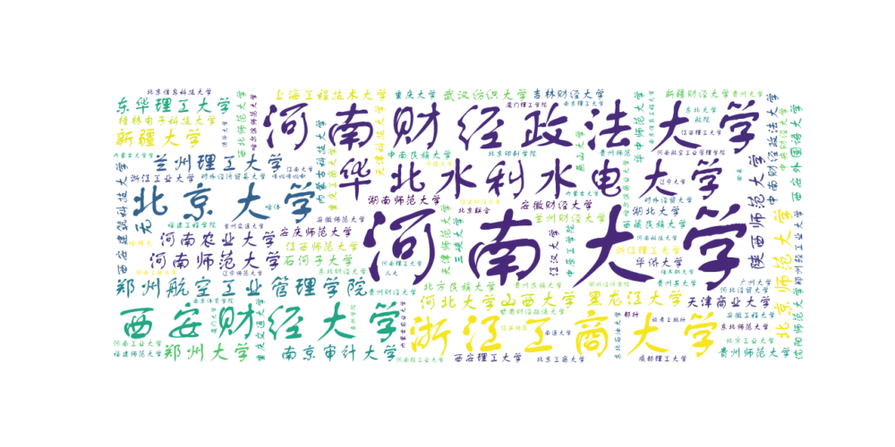
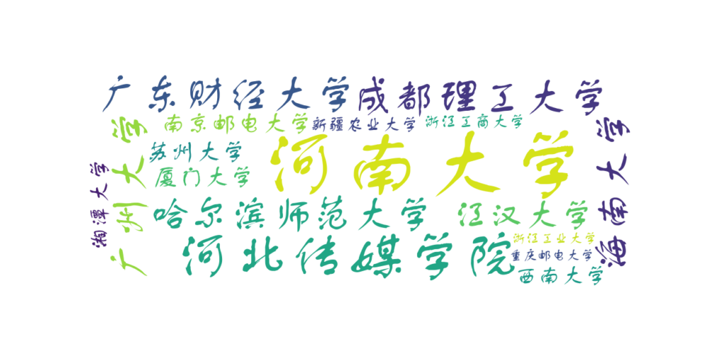
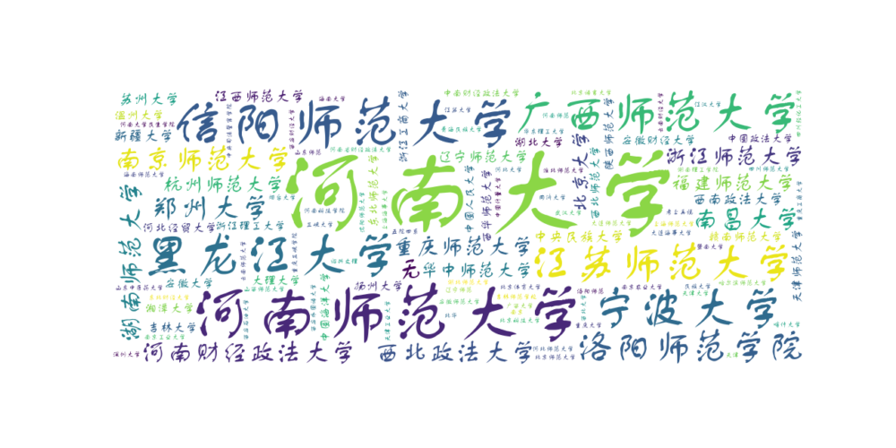
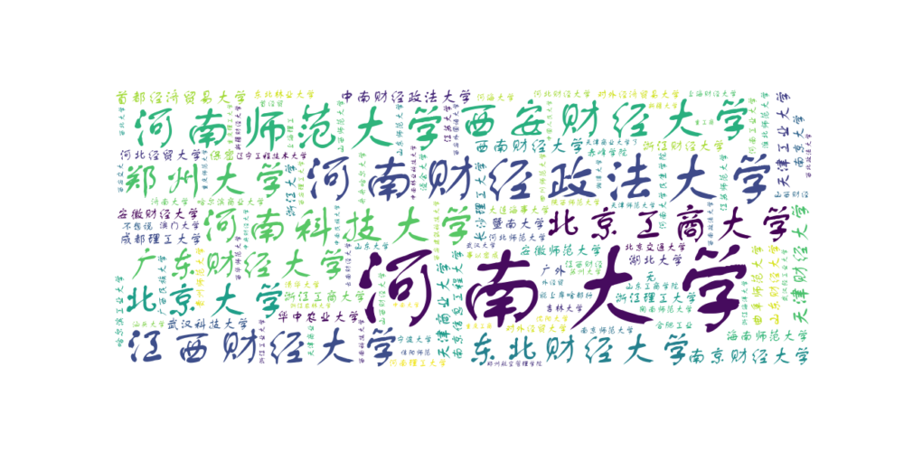
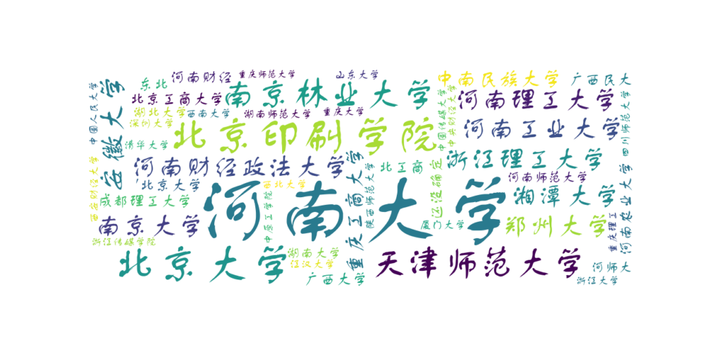

# 目标高校信息



> ### 希望就读的高校：
>
> - 数据显示了一些具体的高校选择，河南大学、郑州大学等是学生比较青睐的高校。（各学院情况的见附录）
>
> ```
> 其具体数据如下：'河南大学': 345, '郑州大学': 31, '河南师范大学': 30, '河南财经政法大学': 27, '北京大学': 20,'河南科技大学': 17, '西安财经大学': 14, '黑龙江大学': 12, '信阳师范大学': 12, '浙江工商大学': 12, '浙江理工大学': 11, '青海大学': 10, '蚌埠医学院': 9, '江西财经大学': 9, '南京师范大学': 9, '宁波大学': 9, '陕西师范大学': 9, '河南理工大学': 8, '江苏师范大学': 8, '苏州大学': 8, '新疆大学': 8, '中南财经政法大学': 8, '北京工商大学': 7, '广西师范大学': 7, '广州医科大学': 7, '湖北大学': 7, '湖南师范大学': 7, '华北水利水电大学': 7, '暨南大学': 7, '江西师范大学': 7, '锦州医科大学': 7, '深圳大学': 7, '天津师范大学': 7, '湘潭大学': 7, '浙江工业大学': 7, '安徽财经大学': 6, '安徽师范大学': 6, '北京师范大学': 6, '北京印刷学院': 6, '东北财经大学': 6, '河北大学': 6, '河南工业大学': 6, '华中师范大学': 6, '江汉大学': 6, '清华大学': 6, '天津商业大学': 6, '武汉科技大学': 6, '西安外国语大学': 6, '西南政法大学': 6, '浙江师范大学': 6, '郑州航空工业管理学院': 6, '重庆师范大学': 6, '成都理工大学': 5, '广东财经大学': 5, '海南大学': 5, '河北经贸大学': 5, '兰州理工大学': 5, '辽宁师范大学': 5, '洛阳师范学院': 5, '南京财经大学': 5, '南京大学': 5, '曲阜师范大学': 5, '厦门大学': 5, '天津财经大学': 5, '天津工业大学': 5, '西北大学': 5, '西北政法大学': 5, '西南财经大学': 5, '浙江中医药大学': 5, '中国人民大学': 5, '中南民族大学': 5, '中原工学院': 5, '重庆工商大学': 5, '遵义医科大学': 5, '安徽大学': 4, '福建师范大学': 4, '广州大学': 4, '桂林电子科技大学': 4, '海南师范大学': 4, '杭州师范大学': 4, '河南农业大学': 4, '南昌大学': 4, '南京林业大学': 4, '三峡大学': 4, '沈阳师范大学': 4, '四川师范大学': 4, '武汉纺织大学': 4, '西安建筑科技大学': 4, '西安理工大学': 4, '西北师范大学': 4, '西华师范大学': 4, '新乡医学院': 4, '浙江财经大学': 4, '中央财经大学': 4, '重庆大学': 4, '重庆邮电大学': 4, '大理大学': 3, '东北师范大学': 3, '东华理工大学': 3, '福州大学': 3, '贵州师范大学': 3, '哈尔滨师范大学': 3, '河南大学民生学院': 3, '华北理工大学': 3, '华侨大学': 3, '淮北师范大学': 3, '吉林大学': 3, '江南大学': 3, '南京审计大学': 3, '南京信息工程大学': 3, '内蒙古科技大学': 3, '山西大学': 3, '山西师范大学': 3, '上海电力大学': 3, '上海工程技术大学': 3, '上海理工大学': 3, '石河子大学': 3, '首都经济贸易大学': 3, '天津理工大学': 3, '武汉理工大学': 3, '西安交通大学': 3, '新疆财经大学': 3, '长安大学': 3, '长沙理工大学': 3, '浙江大学': 3, '中国海洋大学': 3, '中国计量大学': 3, '中央民族大学': 3, '重庆理工大学': 3, '重庆医科大学': 3, '安徽工程大学': 2, '澳门大学': 2, '保密': 2, '北方民族大学': 2, '北京': 2, '北京协和医学院': 2, '常州大学': 2, '成都医学院': 2, '大连海事大学': 2, '东北林业大学': 2, '对外经济贸易大学': 2, '对外经贸大学': 2, '赣南师范大学': 2, '广东外语外贸大学': 2, '广东药科大学': 2, "'广东外语外贸大学": 2, '广西大学': 2, '广西中医药大学': 2, '广州医科大': 2, '贵州大学': 2, '哈尔滨商业大学': 2, '河北传媒学院': 2, '河北师范大学': 2, '河海大学': 2, '河南开封科技传媒学院': 2, '湖北医药学院': 2, '湖州师范学院': 2, '华南理工大学': 2, '华中农业大学': 2, '吉林财经大学': 2, '江苏大学': 2, '景德镇陶瓷大学': 2, '兰州财经大学': 2, '辽宁师范': 2, '南京': 2, '南京理工大学': 2, '南京邮电大学': 2, '南通大学': 2, '内蒙古大学': 2, '能考上就行': 2, '青海民族大学': 2, '泉州师范学院': 2, '山东财经大学': 2, '山东大学': 2, '山东科技大学': 2, '上海师范大学': 2, '首都师范大学': 2, '首都医科大学': 2, '四川外国语大学': 2, '天津大学': 2, '天津科技大学': 2, '天津外国语大学': 2, '天津中医药大学': 2, '温州大学': 2, '温州医科大学': 2, '武汉大学': 2, '武汉工程大学': 2, '西安工业大学': 2, '西安邮电大学': 2, '西北农林科技大学': 2, '西藏民族大学': 2, '西南大学': 2, '新疆农业大学': 2, '新疆师范大学': 2, '新疆医科大学': 2, '徐州医科大学': 2, '延安大学': 2, '延边大学': 2, '燕山大学': 2, '扬州大学': 2, '云南财经大学': 2, '云南大学': 2, '云南中医药大学': 2, '长江大学': 2, '浙江农林大学': 2, '郑州轻工业大学': 2, '中国政法大学': 2, '中南大学': 2, '中南林业科技大学': 2, '重庆交通大学': 2, '重庆理工': 2, '安徽医科大学': 1, '安徽中医药': 1, '安庆师范大学': 1, "'安庆师范大学": 1, '澳门城市大学': 1, '北方工业大学': 1, '北工商': 1, '北华': 1, '北华大学': 1, '北京电影学院': 1, '北京服装学院': 1, '北京交通大学': 1, '北京科技大学': 1, '北京联合': 1, '北京林业大学': 1, '北京体育大学': 1, '北京信息科技大学': 1, '北京语言大学': 1, '北外': 1, '渤海大学': 1, '不想说': 1, '赤峰学院': 1, '川北医学院': 1, '大连工业大学': 1, '大连师范大学': 1, '东北': 1, '东北大学': 1, '东北石油大学': 1, '都行': 1, '福建工程学院': 1, '福建医科大学': 1, '福建中医药大学': 1, '甘肃财经政法大学': 1, '跟俺大爷': 1, '广东工业大学': 1, '广东医科大': 1, '广西民大': 1, '广西民族大学': 1, '广西医科大学': 1, '贵州财经大学': 1, '贵州民族大学': 1, '贵州某大学': 1, '贵州师范': 1, '贵州中医药大学': 1, '哈尔滨工业大学': 1, '哈师大': 1, '哈体': 1, '还没确定': 1, '海南医学院': 1, '杭师大': 1, '杭州电子科技大学': 1, '航院': 1, '合肥工业': 1, '河北财经大学': 1, '河北工业大学': 1, '河科大': 1, '河南': 1, '河南航空工业管理学院': 1, '河南科技学院': 1, '河南轻工业大学': 1, '河南省财经政法大学': 1, "'河南师范大学": 1, '湖北的大学': 1, '湖北工业大学': 1, '湖北经济学院': 1, '湖北美术学院': 1, '湖北汽车工业学院': 1, '湖北师范大学': 1, '湖南大学': 1, '湖南工商大学': 1, '湖南工业大学': 1, '湖南科技大学': 1, '湖南理工学院': 1, '湖州师范': 1, '华东理工大学': 1, '华中科技大学': 1, '黄冈师范学院': 1, '回来': 1, '吉林师范学校': 1, '计算技术研究所': 1, '济南大学': 1, '佳木斯大学': 1, '嘉兴学院': 1, '江苏海洋大学': 1, '江苏师范': 1, '江蘇師範大學': 1, '江西财经': 1, '江西理工大学': 1, '江西农业大学': 1, '锦州医科大': 1, '浸会大学': 1, '喀什大学': 1, '考上再说': 1, '昆明医科大学': 1, '兰州交通大学': 1, '辽宁大学': 1, '辽宁工程技术大学': 1, '噜啦噜啦嘞': 1, '洛师': 1, '洛阳师范': 1, '略': 1, '秘密': 1, '民族大学': 1, '闽南师范大学': 1, '南昌航空大学': 1, '南华大学': 1, '南京工业大学': 1, '南京农业大学': 1, '南京体育学院': 1, '南京信息工程学院': 1, '南京医科大': 1, '南开大学': 1, '内蒙古大学学': 1, '内蒙古农业大学': 1, '能上岸啥都行': 1, '宁夏师范学院': 1, '宁夏医科大学': 1, '齐齐哈尔大学': 1, '青岛理工大学': 1, '曲阜师范': 1, '泉州师范': 1, '人大': 1, '厦门理工学院': 1, '山': 1, '山东工商学院': 1, '山东师范': 1, '山东师范大学': 1, '山东艺术': 1, '山东中医药大学': 1, '山师': 1, '山西财经': 1, '山西财经大学': 1, '山西中医药': 1, '陕西科技大学': 1, '陕西中医药大学': 1, '汕头大学': 1, '上海财经大学': 1, '上海大学': 1, '上海海事大学': 1, '上海理工': 1, '上海立信': 1, '上海立信学院': 1, '上海师范': 1, '上海中医药大学': 1, '绍兴文理': 1, '绍兴文理学院': 1, '沈阳大学': 1, '沈阳工业': 1, '沈阳工业大学': 1, '沈阳理工': 1, '沈阳药科大学': 1, '事以密成': 1, '首经贸': 1, '四川大学': 1, '四川美术学院': 1, '四川轻化工大学': 1, '苏州科技大学': 1, '太原理工大学': 1, '太原师范': 1, '太原师范学院': 1, '天津': 1, '天津农学院': 1, '天津商业': 1, '天津商业大学了': 1, '天津师范': 1, '天津医科': 1, '天津医科大学': 1, '同济大学': 1, '外经贸': 1, '潍坊医学院': 1, '五院四系': 1, '武汉轻工大学': 1, '武汉轻工业大学': 1, '西安大学': 1, '西安电子科技大学': 1, '西安工程大学': 1, '西安石油': 1, '西安石油大学': 1, '西安外国语': 1, '西安政法大学': 1, '西藏农牧学院': 1, '西南科技大学': 1, '西南政法': 1, '香港中文大学': 1, '新疆医科大': 1, '新乡学院': 1, '信阳师范': 1, '烟台大学': 1, "'右江民族医学院": 1, '右江民族医学院': 1, '云南民族大学': 1, '云南师范大学': 1, '暂定': 1, '长春工业大学': 1, '长春理工': 1, '长春中医药大学': 1, '长理': 1, '长治医学院': 1, '浙大城市学院': 1, '浙江传媒学院': 1, '浙江海洋大学': 1, "'郑州大学": 1, '郑州航空管理学院': 1, '郑州轻工': 1, '郑州轻工业': 1, '只要研究生学历': 1, '中国传媒大学': 1, '中国地质大学': 1, '中国计量': 1, '中国矿业大学北京': 1, '中央司法警官学院': 1, '中原工': 1, '仲恺农业工程学院': 1, '重工商': 1, '重庆工商': 1, '重庆工商学院': 1, '重庆三峡学院': 1, '重庆师范': 1, '重庆医科大': 1
> ```


### 艺术（设计）学院



```
'河南大学': 17, '海南大学': 3, '郑州大学': 3, '江西财经大学': 2, '景德镇陶瓷大学': 2,

'南京师范大学': 2, '清华大学': 2, '曲阜师范大学': 2, '泉州师范学院': 2, '新疆师范大学': 2, '中原工学院': 2, '安徽工程大学': 1, '安徽师范大学': 1, '澳门城市大学': 1, '澳门大学': 1, '北华大学': 1, '北京电影学院': 1, '北京服装学院': 1, '北京林业大学': 1, '北京师范大学': 1, '常州大学': 1, '大连工业大学': 1, '福州大学': 1, '广西师范大学': 1, '贵州大学': 1, '海南师范大学': 1, '杭州师范大学': 1, '河南工业大学': 1, '河南开封科技传媒学院': 1, '河南科技大学': 1, '黑龙江大学': 1, '湖北工业大学': 1, '湖北美术学院': 1, '湖南工业大学': 1, '湖南科技大学': 1, '湖州师范': 1, '湖州师范学院': 1, '华侨大学': 1, '淮北师范': 1, '暨南大学': 1, '江汉大学': 1, '江苏海洋大学': 1, '江蘇師範大學': 1, '江西农业大学': 1, '宁夏师范学院': 1, '曲阜师范': 1, '泉州师范': 1, '厦门大学': 1, '山东科技大学': 1, '山东艺术': 1, '上海理工大学': 1, '绍兴文理学院': 1, '沈阳理工': 1, '沈阳师范大学': 1, '首都师范大学': 1, '四川大学': 1, '四川美术学院': 1, '四川外国语大学': 1, '苏州科技大学': 1, '太原理工大学': 1, '太原师范学院': 1, '天津理工大学': 1, '武汉纺织大学': 1, '武汉理工大学': 1, '西安交通大学': 1, '西北大学': 1, '信阳师范大学': 1, '云南民族大学': 1, '暂定': 1, '长安大学': 1, '浙大城市学院': 1, '浙江财经大学': 1, '浙江工业大学': 1, '中国计量': 1, '中国计量大学': 1, '中南林业科技大学': 1, '中原工': 1, '仲恺农业工程学院': 1, '重庆邮电大学': 1
```


### 医学院



```
'河南大学': 36, '蚌埠医学院': 9, '广州医科大学': 9, '河南科技大学': 9, '青海大学': 9, 

'锦州医科大学': 7, '浙江中医药大学': 5, '遵义医科大学': 5, '新乡医学院': 4, '华北理工大学': 3, '苏州大学': 3, '武汉科技大学': 3, '重庆医科大学': 3, '北京协和医学院': 2, '成都医学院': 2, '广东药科大学': 2, '广西中医药大学': 2, '湖北医药学院': 2, '暨南大学': 2, '首都医科大学': 2, '天津中医药大学': 2, '温州医科大学': 2, '无': 2, '新疆医科大学': 2, '徐州医科大学': 2, '云南中医药大学': 2, '安徽医科大学': 1, '安徽中医药': 1, '北京大学': 1, '川北医学院': 1, '大理大学': 1, '福建医科大学': 1, '福建中医药大学': 1, '广东医科大': 1, '广西医科大学': 1, '贵州中医药大学': 1, '海南医学院': 1, '杭州师范大学': 1, '河南开封科技传媒学院': 1, '江苏师范大学': 1, '锦州医科大': 1, '昆明医科大学': 1, '南华大学': 1, '南京医科大': 1, '南通大学': 1, '宁夏医科大学': 1, '青海民族大学': 1, '山西中医药': 1, '陕西中医药大学': 1, '上海中医药大学': 1, '深圳大学': 1, '沈阳药科大学': 1, '天津医科': 1, '天津医科大学': 1, '潍坊医学院': 1, '西藏农牧学院': 1, '西南': 1, '新疆医科大': 1, '延安大学': 1, '延边大学': 1, '右江': 1, '右江民族医学院': 1, '长春中医药大学': 1, '长江大学': 1, '长治医学院': 1, '郑州大学': 1, '中南大学': 1, '重庆理工': 1, '重庆理工大学': 1, '重庆医科大': 1
```


### 信息工程学院



```
'河南大学': 96, '郑州大学': 10, '河南理工大学': 4, '深圳大学': 4, '上海电力大学': 3,

'浙江理工大学': 3, '北京大学': 2, '福州大学': 2, '广州大学': 2, '桂林电子科技大学': 2, '华北水利水电大学': 2, '江南大学': 2, '江西师范大学': 2, '辽宁师范大学': 2, '南京大学': 2, '上海理工大学': 2, '天津理工大学': 2, '长安大学': 2, '长春理工': 2, '浙江工业大学': 2, '安徽师范大学': 1, '常州大学': 1, '东北林业大学': 1, '广东工业大学': 1, '广东外语外贸大学': 1, '杭州电子科技大学': 1, '河北大学': 1, '河北工业大学': 1, '河海大学': 1, '河南工业大学': 1, '河南科技大学': 1, '河南师范大学': 1, '湖北大学': 1, '湖北汽车工业学院': 1, '华中科技大学': 1, '计算技术研究所': 1, '暨南大学': 1, '兰州理工大学': 1, '南昌航空大学': 1, '南京财经大学': 1, '南京理工大学': 1, '南京林业大学': 1, '南京师范大学': 1, '南京信息工程学院': 1, '南京邮电大学': 1, '南开大学': 1, '内蒙古大学': 1, '内蒙古科技大学': 1, '宁波大学': 1, '青岛理工大学': 1, '青海大学': 1, '清华大学': 1, '三峡大学': 1, '厦门大学': 1, '山东科技大学': 1, '陕西科技大学': 1, '陕西师范大学': 1, '沈阳工业大学': 1, '首都师范大学': 1, '四川师范大学': 1, '天津工业大学': 1, '武汉理工大学': 1, '西安电子科技大学': 1, '西安工业大学': 1, '西安理工大学': 1, '西安外国语大学': 1, '西安邮电大学': 1, '西北农林科技大学': 1, '西南政法大学': 1, '湘潭大学': 1, '云南大学': 1, '长沙理工大学': 1, '中国计量大学': 1, '重庆师范': 1, '重庆邮电大学': 1
```


### 外语学院



```
'河南大学': 7, '河南师范大学': 3, '华南理工大学': 2, '武汉工程大学': 2, '北外': 1, 

'渤海大学': 1, '广东外语外贸大学': 1, '河北大学': 1, '河南财经政法大学': 1, '河南大学民生学院': 1, '黑龙江大学': 1, '湖州师范学院': 1, '华中师范大学': 1, '黄冈师范学院': 1, '江苏师范大学': 1, '洛师': 1, '曲阜师范大学': 1, '陕西师范大学': 1, '四川外国语大学': 1, '天津外国语大学': 1, '新乡学院': 1, '信阳师范大学': 1, '浙江工商大学': 1, '浙江师范大学': 1, '郑州大学': 1, '郑州航空工业管理学院': 1, '中国地质大学': 1, '中国海洋大学': 1, '重庆邮电大学': 1
```


### 商学院



```
'河南大学': 37, '河南财经政法大学': 9, '浙江工商大学': 6, '北京大学': 5, '华北水利水电大学': 5, 

'西安财经大学': 5, '郑州航空工业管理学院': 5, '北京师范大学': 4, '河南师范大学': 4, '兰州理工大学': 4, '无': 4, '新疆大学': 4, '郑州大学': 4, '东华理工大学': 3, '河北大学': 3, '河南农业大学': 3, '黑龙江大学': 3, '南京审计大学': 3, '山西大学': 3, '陕西师范大学': 3, '上海工程技术大学': 3, '石河子大学': 3, '天津商业大学': 3, '武汉纺织大学': 3, '西安建筑科技大学': 3, '西安外国语大学': 3, '中南财经政法大学': 3, '安徽财经大学': 2, '安庆师范大学': 2, '北方民族大学': 2, '贵州师范大学': 2, '桂林电子科技大学': 2, '湖北大学': 2, '湖南师范大学': 2, '华侨大学': 2, '华中师范大学': 2, '吉林财经大学': 2, '江汉大学': 2, '江西师范大学': 2, '兰州财经大学': 2, '内蒙古科技大学': 2, '三峡大学': 2, '沈阳师范大学': 2, '天津科技大学': 2, '天津师范大学': 2, '西安理工大学': 2, '西北师范大学': 2, '西藏民族大学': 2, '新疆财经大学': 2, '燕山大学': 2, '浙江工业大学': 2, '浙江理工大学': 2, '郑州轻工业大学': 2, '中南民族大学': 2, '中央财经大学': 2, '中原工学院': 2, '重庆大学': 2, '重庆工商大学': 2, '重庆交通大学': 2, '安徽工程大学': 1, '安徽师范大学': 1, '北方工业大学': 1, '北京工商大学': 1, '北京联合': 1, '北京信息科技大学': 1, '北京印刷学院': 1, '成都理工大学': 1, '东北财经大学': 1, '东北大学': 1, '东北师范大学': 1, '东北石油大学': 1, '都行': 1, '对外经济贸易大学': 1, '对外经贸大学': 1, '福建工程学院': 1, '福建师范大学': 1, '甘肃财经政法大学': 1, '广州大学': 1, '贵州财经大学': 1, '贵州大学': 1, '贵州民族大学': 1, '贵州某大学': 1, '贵州师范': 1, '哈尔滨商业大学': 1, '哈尔滨师范大学': 1, '哈师大': 1, '哈体': 1, '航院': 1, '河北经贸大学': 1, '河南工业大学': 1, '河南航空工业管理学院': 1, '河南科技大学': 1, '河南理工大学': 1, '河南轻工业大学': 1, '湖北经济学院': 1, '湖南工商大学': 1, '回来': 1, '佳木斯大学': 1, '嘉兴学院': 1, '江南大学': 1, '江苏师范': 1, '江西财经大学': 1, '江西理工大学': 1, '兰州交通大学': 1, '辽宁大学': 1, '辽宁师范大学': 1, '噜啦噜啦嘞': 1, '南京理工大学': 1, '南京体育学院': 1, '南京信息工程大学': 1, '南通大学': 1, '内蒙古大学': 1, '内蒙古大学学': 1, '内蒙古农业大学': 1, '能考上就行': 1, '宁波大学': 1, '清华大学': 1, '人大': 1, '厦门大学': 1, '厦门理工学院': 1, '山师': 1, '山西师范大学': 1, '上海大学': 1, '上海立信': 1, '上海立信学院': 1, '上海师范': 1, '上海师范大学': 1, '沈阳工业': 1, '太原师范': 1, '天津财经大学': 1, '天津大学': 1, '天津农学院': 1, '天津外国语大学': 1, '武汉科技大学': 1, '武汉理工大学': 1, '武汉轻工大学': 1, '西安大学': 1, '西安工程大学': 1, '西安工业大学': 1, '西安交通大学': 1, '西安石油': 1, '西安外国语': 1, '西安邮电大学': 1, '西安政法大学': 1, '西北大学': 1, '西北农林科技大学': 1, '西华师范大学': 1, '西南政法': 1, '西南政法大学': 1, '香港中文大学': 1, '新疆农业大学': 1, '信阳师范大学': 1, '延安大学': 1, '延边大学': 1, '云南大学': 1, '长春工业大学': 1, '长江大学': 1, '浙江财经大学': 1, '浙江农林大学': 1, '浙江师范大学': 1, '郑大': 1, '郑州轻工': 1, '郑州轻工业': 1, '只要研究生学历': 1, '中国矿业大学北京': 1, '中国人民大学': 1, '重庆工商学院': 1, '重庆理工大学': 1
```


### 融媒学院



```
'河南大学': 5, '河北传媒学院': 2, '成都理工大学': 1, '广东财经大学': 1, '广州大学': 1, 

'哈尔滨师范大学': 1, '海南大学': 1, '江汉大学': 1, '南京邮电大学': 1, '厦门大学': 1, '苏州大学': 1, '西南大学': 1, '湘潭大学': 1, '新疆农业大学': 1, '浙江工商大学': 1, '浙江工业大学': 1, '重庆邮电大学': 1
```


### 人文学院



```
'河南大学': 41, '河南师范大学': 12, '信阳师范大学': 9, '黑龙江大学': 7, '广西师范大学': 6, '宁波大学': 6, 

'江苏师范大学': 5, '洛阳师范学院': 5, '南京师范大学': 5, '郑州大学': 5, '河南财经政法大学': 4, '湖南师范大学': 4, '南昌大学': 4, '无': 4, '西北政法大学': 4, '浙江师范大学': 4, '重庆师范大学': 4, '北京大学': 3, '福建师范大学': 3, '杭州师范大学': 3, '华中师范大学': 3, '江西师范大学': 3, '辽宁师范大学': 3, '苏州大学': 3, '西南政法大学': 3, '新疆大学': 3, '中央民族大学': 3, '安徽财经大学': 2, '安徽大学': 2, '大理大学': 2, '东北师范大学': 2, '赣南师范大学': 2, '河北经贸大学': 2, '湖北大学': 2, '吉林大学': 2, '陕西师范大学': 2, '天津师范大学': 2, '温州大学': 2, '西北师范大学': 2, '西华师范大学': 2, '湘潭大学': 2, '扬州大学': 2, '浙江工商大学': 2, '浙江理工大学': 2, '中国海洋大学': 2, '中国人民大学': 2, '中国政法大学': 2, '中南财经政法大学': 2, '安徽师范大学': 1, '北华': 1, '北京科技大学': 1, '北京师范大学': 1, '北京体育大学': 1, '北京语言大学': 1, '大连海事大学': 1, '大连师范大学': 1, '东北财经大学': 1, '广西大学': 1, '哈尔滨师范大学': 1, '海南大学': 1, '海南师范大学': 1, '河北大学': 1, '河北师范大学': 1, '河南大学民生学院': 1, '河南科技学院': 1, '河南省财经政法大学': 1, '河南师范': 1, '湖北师范大学': 1, '湖南理工学院': 1, '华东理工大学': 1, '淮北师范大学': 1, '吉林师范学校': 1, '暨南大学': 1, '江汉大学': 1, '江苏大学': 1, '喀什大学': 1, '考上再说': 1, '辽宁师范': 1, '洛阳师范': 1, '民族大学': 1, '南京': 1, '南京工业大学': 1, '南京农业大学': 1, '青海民族大学': 1, '三峡大学': 1, '山东师范': 1, '山东中医药大学': 1, '山西师范大学': 1, '上海海事大学': 1, '上海师范大学': 1, '绍兴文理': 1, '深圳大学': 1, '沈阳师范大学': 1, '四川轻化工大学': 1, '四川师范大学': 1, '天津': 1, '天津大学': 1, '天津工业大学': 1, '同济大学': 1, '五院四系': 1, '武汉大学': 1, '西安财经大学': 1, '西安石油大学': 1, '西安外国语大学': 1, '西北大学': 1, '烟台大学': 1, '云南财经大学': 1, '云南师范大学': 1, '中国计量大学': 1, '中央司法警官学院': 1, '重庆大学': 1, '重庆工商大学': 1, '重庆三峡学院': 1
```


### 经济学院



```
'河南大学': 66, '河南财经政法大学': 10, '河南师范大学': 8, '西安财经大学': 7, '河南科技大学': 6, '江西财经大学': 6, 

'北京大学': 5, '北京工商大学': 5, '郑州大学': 5, '东北财经大学': 4, '广东财经大学': 4, '南京财经大学': 4, '天津财经大学': 4, '西南财经大学': 4, '首都经济贸易大学': 3, '天津工业大学': 3, '天津商业大学': 3, '中南财经政法大学': 3, '安徽财经大学': 2, '安徽师范大学': 2, '保密': 2, '成都理工大学': 2, '广外': 2, '海南师范大学': 2, '河北经贸大学': 2, '湖北大学': 2, '华中农业大学': 2, '暨南大学': 2, '南京大学': 2, '南京信息工程大学': 2, '曲阜师范大学': 2, '山东财经大学': 2, '无': 2, '武汉科技大学': 2, '长沙理工大学': 2, '浙江财经大学': 2, '浙江大学': 2, '浙江工商大学': 2, '浙江理工大学': 2, '澳门大学': 1, '北京交通大学': 1, '不想说': 1, '赤峰学院': 1, '大连海事大学': 1, '东北林业大学': 1, '对外经济贸易大学': 1, '对外经贸大学': 1, '广西民族大学': 1, '贵州师范大学': 1, '哈尔滨工业大学': 1, '哈尔滨商业大学': 1, '合肥工业': 1, '河北财经大学': 1, '河北师范大学': 1, '河海大学': 1, '河南大学民生学院': 1, '河南工业大学': 1, '河南理工大学': 1, '淮北师范大学': 1, '吉林大学': 1, '济南大学': 1, '江苏大学': 1, '江苏师范大学': 1, '江西财经': 1, '浸会大学': 1, '辽宁工程技术大学': 1, '闽南师范大学': 1, '南京师范大学': 1, '能上岸啥都行': 1, '宁波大学': 1, '齐齐哈尔大学': 1, '清华大学': 1, '山东大学': 1, '山东工商学院': 1, '山东师范大学': 1, '山西财经': 1, '山西财经大学': 1, '山西师范大学': 1, '陕西师范大学': 1, '汕头大学': 1, '上海财经大学': 1, '上海理工': 1, '沈阳大学': 1, '事以密成': 1, '首经贸': 1, '四川师范大学': 1, '苏州大学': 1, '天津商业': 1, '天津商业大学了': 1, '天津师范大学': 1, '外经贸': 1, '武汉大学': 1, '武汉轻工业大学': 1, '西安建筑科技大学': 1, '西安交大': 1, '西安理工大学': 1, '西安外国语大学': 1, '西北大学': 1, '西北政法大学': 1, '西华师范大学': 1, '西南科技大学': 1, '西南政法大学': 1, '湘潭大学': 1, '新疆财经大学': 1, '新疆大学': 1, '信阳师范': 1, '云南财经大学': 1, '浙江工业大学': 1, '浙江海洋大学': 1, '浙江农林大学': 1, '郑州航空管理学院': 1, '中国人民大学': 1, '中南大学': 1, '中南林业科技大学': 1, '中南民族大学': 1, '中央财经大学': 1, '重工商': 1, '重庆工商': 1, '重庆理工大学': 1, '重庆师范大学': 1
```


### 传播学院



```
'河南大学': 41, '北京大学': 5, '北京印刷学院': 5, '南京林业大学': 3, '天津师范大学': 3, '安徽大学': 2, 

'河南财经政法大学': 2, '河南工业大学': 2, '河南理工大学': 2, '南京大学': 2, '湘潭大学': 2, '浙江理工大学': 2, '郑州大学': 2, '中南民族大学': 2, '重庆工商大学': 2, '北工商': 1, "'北京大学": 1, '北京工商大学': 1, '成都理工大学': 1, '东北': 1, '广西大学': 1, '广西民大': 1, '还没确定': 1, '河南财经': 1, '河南农业大学': 1, '河南师范大学': 1, '河师大': 1, '湖北大学': 1, '湖南大学': 1, '湖南师范大学': 1, '江汉大学': 1, '清华大学': 1, '厦门大学': 1, '山东大学': 1, '陕西师范大学': 1, '深圳大学': 1, '四川师范大学': 1, '西安财经大学': 1, '西北大学': 1, '西南大学': 1, '浙江传媒学院': 1, '浙江大学': 1, '中国传媒大学': 1, '中国人民大学': 1, '中央财经大学': 1, '中原工学院': 1, '重庆大学': 1, '重庆理工': 1, '重庆师范大学': 1
```

