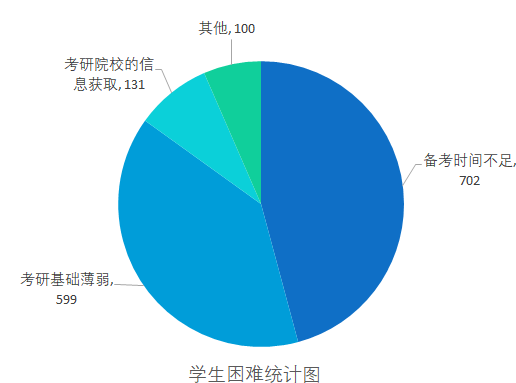

# 考研过程

> **您几年级的时候决定考研?** 
>
> 大一
>
> 大二
>
> 大三
>
> 大四

> **您何时开始复习考研?** 
>
> 大一上
>
> 大一下
>
> 大二上
>
> 大二下
>
> 大三上
>
> 大三下
>
> 大四上

> **您觉得下列那个选项是您在考研时的最大困难:**
>
> 备考时间不足
>
> 考研科目基础薄弱
>
> 考研院校的信息获取
>
> 其他

上述问题的数据通过分析，其结果在`3.1考研时间节点`中体现。

> **您是否愿意报考专业型硕士?** 
>
> 愿意
>
> 不愿意

上述问题的数据通过分析，其结果在`3.2专硕/学硕比例`中体现。

> **是否需要考试数学科目**
>
> 是
>
> 否

> **考研报考专业是否与本科专业一致？** 
>
> 一致
>
> 不一致

> **您觉得您的弱势科目有**
>
> 政治
>
> 外语
>
> 业务课一
>
> 业务课二

上述问题的数据通过分析，其结果在`3.3薄弱学科与跨专业报考`中体现。

> **是否参加过校内政治类辅导班：**
>
> 参加
>
> 未参加

> **是否参加校外政治类辅导班：**
>
> 参加
>
> 未参加

> **是否参加过校内英语类辅导班**：
>
> 参加
>
> 未参加

> **是否参加校外英语类辅导班**：
>
> 参加
>
> 未参加

> **是否参加过校内数学类辅导班**：
>
> 参加
>
> 未参加

> **是否参加校外数学类辅导班**：
>
> 参加
>
> 未参加

> 是否参加过校内专业课辅导班：
>
> 参加
>
> 未参加

> 是否参加校外专业课辅导班：
>
> 参加
>
> 未参加

上述问题的数据通过分析，其结果在`3.4辅导班信息`中体现。

> **希望就读的高校是?** 

上述问题的数据通过分析，其结果在`3.5目标高校信息`中体现。

> - **备考时间不足：** 在所有回答中，有702位考生认为备考时间不足是他们在考研过程中面临的最大困难。这表明我校大部分的考研学子在考研时感受到时间紧迫，分析可能的原因是由于其他学业或生活压力导致备考时间不足。
> - **考研科目基础薄弱：** 有599位考生选择考研科目基础薄弱作为最大困难。这说明一部分考生感觉在某些科目上的基础较差，需要更多的时间和努力来弥补。
> - **考研院校的信息获取：** 有131位考生认为考研院校的信息获取是他们面临的最大困难。这意味着一些考生在选择报考院校时感到信息不足，或者他们在获取相关信息方面遇到了一些困难，需要学校的帮助。
> - **其他：** 还有100位考生选择了“其他”作为最大困难。这是由于个体差异的，具体的困难因素可能因人而异，需要深入调查了解。