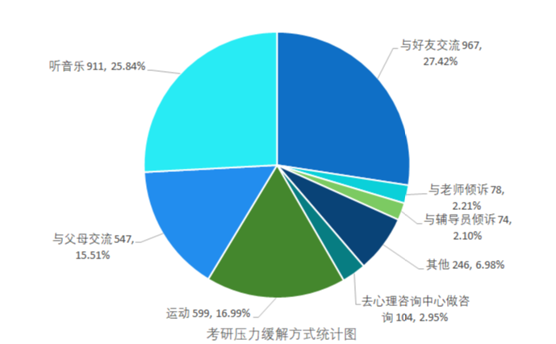

# 考研缓解压力途径

> #### 朋友、音乐与运动是我校学生考研路上的压力释放所
>
> 1. **听音乐（911人选择）：** 音乐可能被视为一种缓解压力和放松身心的方式。考研学生通过听音乐来调节情绪，减轻考试压力。
> 2. **与父母交流（547人选择）：** 与父母交流可能代表考研学生寻求家庭支持和理解，通过与家人分享问题来获得心理支持。
> 3. **运动（599人选择）：** 运动被认为是一种有效的释放压力和保持身心健康的方式。选择运动可能有助于缓解考试压力，提高学习效率。
> 4. **心理咨询中心（104人选择）：** 一部分考研学生选择寻求专业心理咨询服务，这表明他们意识到需要更深入的心理支持来应对考试压力。
> 5. **辅导员倾诉（74人选择）：** 与学校辅导员倾诉可能是寻求学业上的建议和支持，以及解决个人问题的一种途径。
> 6. **老师倾诉（78人选择）：** 与老师交流可能代表学生寻求学科方面的指导和支持，希望通过与老师交流来解决学习上的问题。
> 7. **与好友交流（967人选择）：** 与朋友交流可能是通过分享彼此的经验和感受来获得情感上的支持，建立彼此间的情感连接。
> 8. **其他（246人选择）：** "其他" 的选项可能包括各种不同的应对方式，如吃美食。

- **社交和支持需求：** 从选择听音乐和与好友交流的高比例来看，学生在备考过程中更倾向于通过娱乐和社交的方式来缓解压力。这表明学生可能需要更多的社交支持和活动，以帮助他们在紧张的备考阶段保持情绪的稳定。
- **家庭支持的重要性：** 与父母交谈的选择占比较高，说明家庭支持在学生备考过程中也是重要的，并且在学生选择考研影响最大的人中60%选择了家长。学校可以通过提供家庭支持资源或工作访谈的方式来进一步加强学生与家人之间的交流。
- **身体活动和健康需求：** 运动的选择比例相对较高，这反映了学生对身体活动和健康的需求。学校应该考虑加大体育和健康相关的活动，以支持学生在备考期间保持身体健康。
- **情感和心理健康支持：** 去心理咨询中心做咨询的选择比例较低，但仍然有一部分学生选择这种方式。这表明一些学生在备考过程中需要更多的情感和心理健康的支持。同时学校应该进一步提高学生对心理健康服务的认识，并积极鼓励学生寻求专业的心理支持。