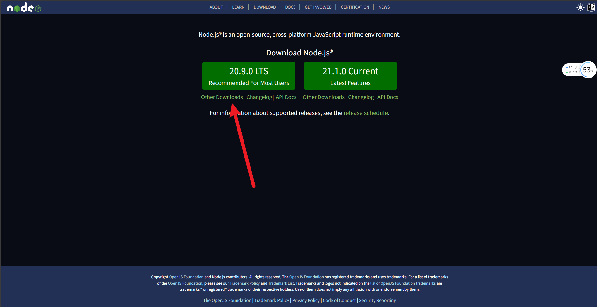
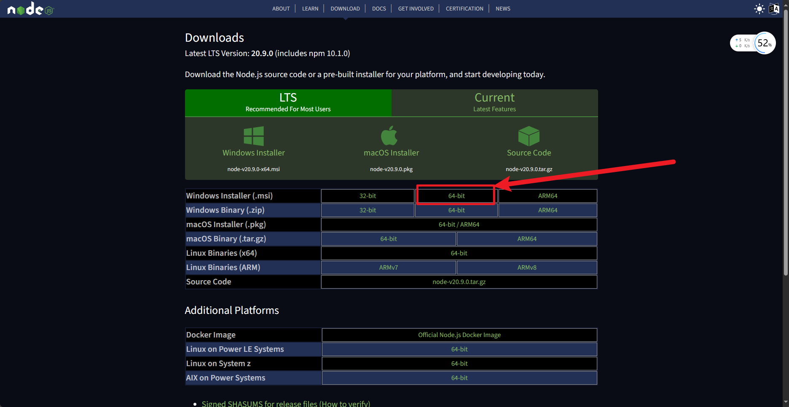
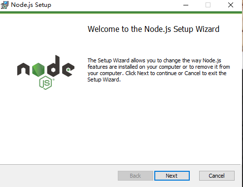
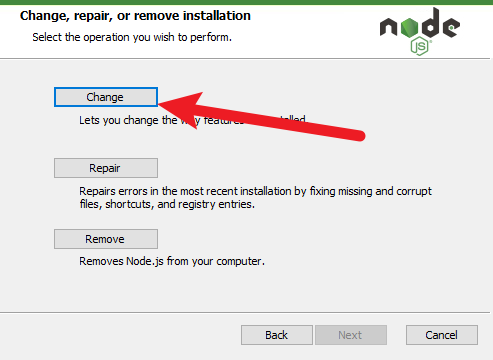
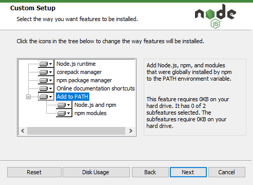
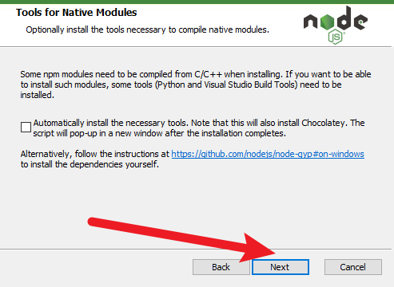
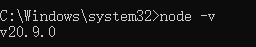

# node.js安装教程（windows）

## 1.Node.js简介

Node.js 是一个基于 Chrome V8 引擎的 JavaScript 运行时。Node.js 使用高效、轻量级的事件驱动、非阻塞 I/O 模型。它的包生态系统，npm，是目前世界上最大的开源库生态系统。

## 2.下载node.js--[下载地址](https://nodejs.org/en)

1.如图点击 Other Downloads

2.选择Windows Installer (.msi) **下载msi文件安装后可以让系统替我们配置node.js的环境变量**

3.下载好后打开安装包

选择Add to PATH 任何点击Next

4.安装好后我们打开cmd 输入`node -v`查看是否安装成功

