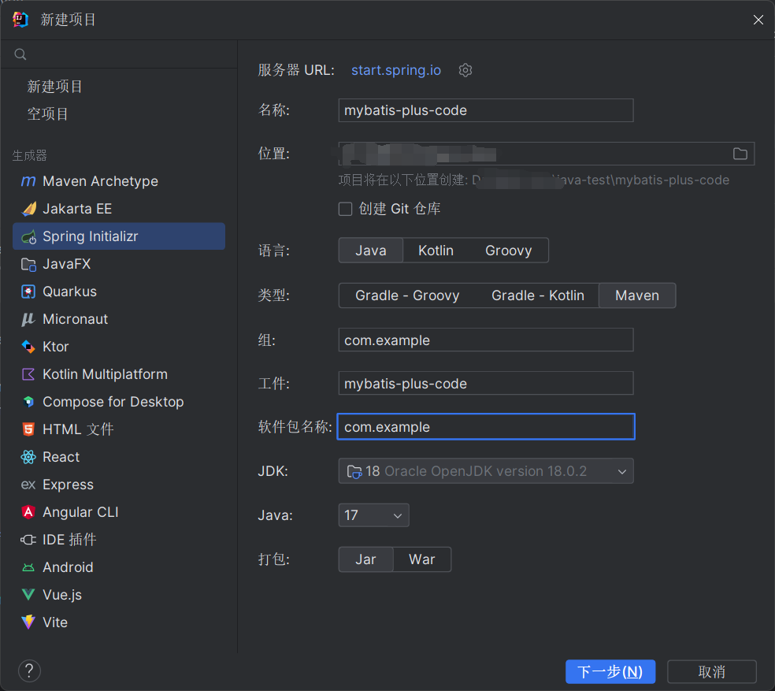
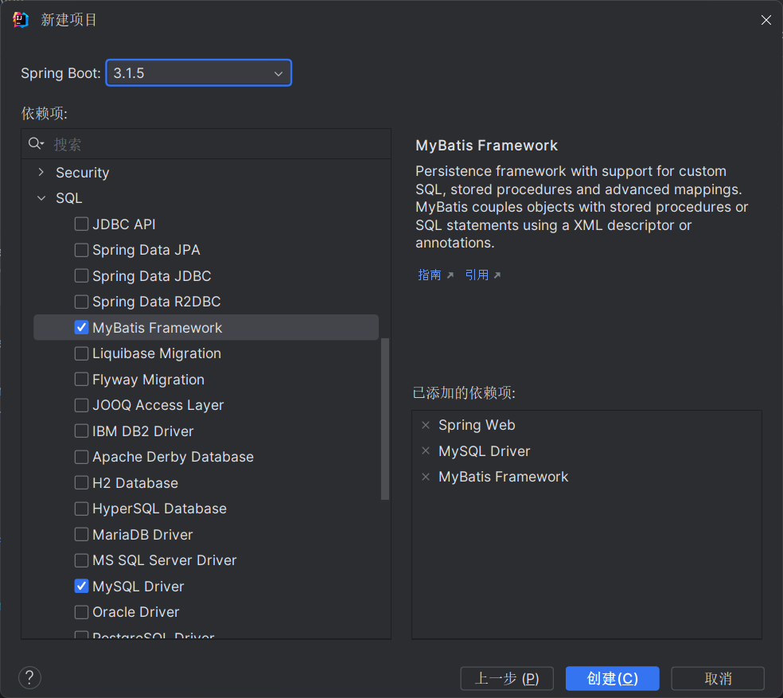
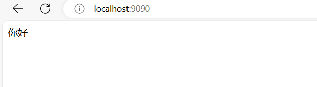
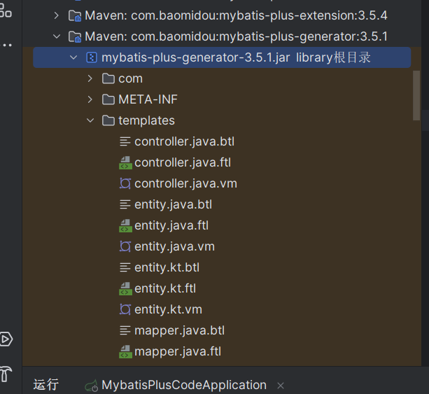
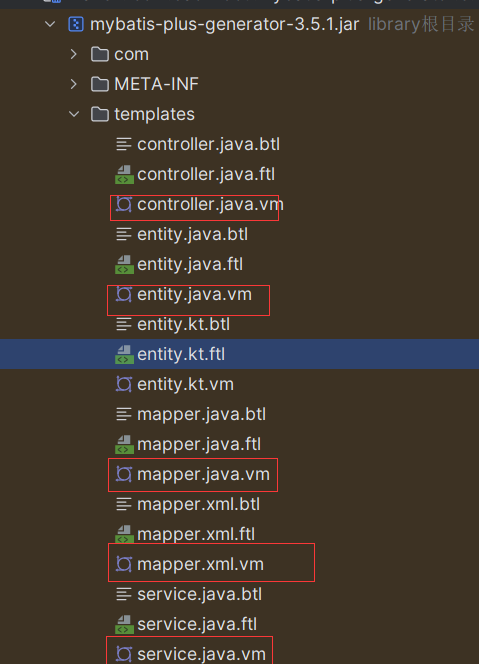

# yc 的 bOok

### 一，mybatis-plus的简介

​ MyBatis-Plus 是一个 Mybatis 增强版工具，在 MyBatis 上扩充了其他功能没有改变其基本功能，为了简化开发提交效率而存在。

​ 官网文档地址：https://baomidou.com/

​ 代码生成器(新)文档: https://baomidou.com/pages/981406/

它的作用就是为了方便我们以后快速开发，因为在大多数的情况下，我们都是适用的三层结构，他的原理就是

好比造句：

​ \_\_\_\__**去**_

例如：我去学校，你去玩，他们中间的都一样，而代码生成器就是起一个自动替换的功能，下面让我们试试吧

### 二，一个简单的基于mybatis-plus的程序

​ 首先新建一个spring boot的项目





第一步连接数据库 `application.yml`

```yml
server:
  port: 9090
spring:
  datasource:
    driver-class-name: com.mysql.cj.jdbc.Driver
    url: jdbc:mysql://localhost:3306/code?serverTimezone=GMT%2b8
    username: root
    password: 你的MySQL的密码
```

再创建一个表

```mysql
CREATE TABLE `student` (
  `id` int(11) NOT NULL AUTO_INCREMENT COMMENT 'id',
  `name` varchar(255) COLLATE utf8mb4_bin DEFAULT NULL COMMENT '姓名',
  `grades` int(11) DEFAULT NULL COMMENT '成绩',
  PRIMARY KEY (`id`)
) ENGINE=InnoDB AUTO_INCREMENT=4 DEFAULT CHARSET=utf8mb4 COLLATE=utf8mb4_bin;
```

先测试准备一个启动程序

`Test.java`

```java
import org.springframework.web.bind.annotation.GetMapping;
import org.springframework.web.bind.annotation.RequestMapping;
import org.springframework.web.bind.annotation.RestController;
@RestController
@RequestMapping
public class Test {
    @GetMapping
    public String test(){
        return "你好";
    }
}

```

然后运行，这样算成功



然后导入mybatis-plus依赖刷新maven

```java
  <!-- mybatis-plus-->
       <!-- https://mvnrepository.com/artifact/com.baomidou/mybatis-plus-boot-starter -->
        <dependency>
            <groupId>com.baomidou</groupId>
            <artifactId>mybatis-plus-boot-starter</artifactId>
            <version>3.5.4</version>
        </dependency>
        <!--代码生成器-->
        <dependency>
            <groupId>com.baomidou</groupId>
            <artifactId>mybatis-plus-generator</artifactId>
            <version>3.5.1</version>
        </dependency>
        <!--需要的引擎 https://mvnrepository.com/artifact/org.apache.velocity/velocity -->
        <dependency>
            <groupId>org.apache.velocity</groupId>
            <artifactId>velocity</artifactId>
            <version>1.7</version>
        </dependency>
              <!-- https://mvnrepository.com/artifact/log4j/log4j -->
        <dependency>
            <groupId>log4j</groupId>
            <artifactId>log4j</artifactId>
            <version>1.2.17</version>
        </dependency>

        <dependency>
            <groupId>org.projectlombok</groupId>
            <artifactId>lombok</artifactId>
            <optional>true</optional>
        </dependency>
```

`MybatisPlusConfig.java`

配置文件

```java
import com.baomidou.mybatisplus.annotation.DbType;
import com.baomidou.mybatisplus.extension.plugins.MybatisPlusInterceptor;
import com.baomidou.mybatisplus.extension.plugins.inner.PaginationInnerInterceptor;
import org.mybatis.spring.annotation.MapperScan;
import org.springframework.context.annotation.Bean;
import org.springframework.context.annotation.Configuration;
//注解想注入到容器中必须加@Configuration被识别
@Configuration
@MapperScan("com.yuan.springboot.mapper")
public class MybatisPlusConfig {
    /**
     * 添加分页插件
     **/
    @Bean
    public MybatisPlusInterceptor mybatisPlusInterceptor() {
        MybatisPlusInterceptor interceptor = new MybatisPlusInterceptor();
        interceptor.addInnerInterceptor(new PaginationInnerInterceptor(DbType.MYSQL));//如果配置多个插件,切记分页最后添加
        //interceptor.addInnerInterceptor(new PaginationInnerInterceptor()); 如果有多数据源可以不配具体类型 否则都建议配上具体的DbType
        return interceptor;
    }
}

```



找到以下的文件复制到resources/templates



再测试类中进行测试需要根据自己的需求求改

`MybatisPlusCodeApplicationTests.java`

```java
import com.baomidou.mybatisplus.generator.FastAutoGenerator;
import com.baomidou.mybatisplus.generator.config.OutputFile;
import org.junit.jupiter.api.Test;
import org.springframework.boot.test.context.SpringBootTest;
import java.util.Collections;
@SpringBootTest
class MybatisPlusCodeApplicationTests {
    @Test
    void contextLoads() {
        generate();
    }
    private void generate() {
        FastAutoGenerator.create("jdbc:mysql://localhost:3306/code?serverTimezone=GMT%2b8", "root", "yuan0530")
                .globalConfig(builder -> {
                    builder.author("自己diy") // 设置作者
                            .fileOverride() // 覆盖已生成文件
                            .outputDir("/袁鹏的训练/java-test/mybatis-plus-code/src/main/java/"); // 指定输出目录
                })
                .packageConfig(builder -> {
                    builder.parent("com.example") // 设置父包名
                            .moduleName("") // 设置父包模块名
                            .pathInfo(Collections.singletonMap(OutputFile.mapperXml, "/袁鹏的训练/java-test/mybatis-plus-code/src/main/resources/mapper/")); // 设置mapperXml生成路径
                })
                .strategyConfig(builder -> {
                    builder.entityBuilder().enableLombok();
                    builder.mapperBuilder().enableMapperAnnotation().build();
                    builder.controllerBuilder().enableHyphenStyle()  // 开启驼峰转连字符
                            .enableRestStyle();  // 开启生成@RestController 控制器
                    builder.addInclude("student") // 设置需要生成的表名就是数据库中创建那个
                            .addTablePrefix(""); // 设置过滤表前缀
                })
//                .templateEngine(new FreemarkerTemplateEngine()) // 使用Freemarker引擎模板，默认的是Velocity引擎模板
                .execute();
   }
}
```

运行后生成的文件目录


还可以自己diy生成的代码

再`controller.java.vm`中修改

```java
package ${package.Controller};

import com.baomidou.mybatisplus.extension.plugins.pagination.Page;
import org.springframework.web.bind.annotation.*;
import java.util.List;
import $!{package.Service}.$!{table.serviceName};
import ${package.Entity}.${entity};
#if(${superControllerClassPackage})
import ${superControllerClassPackage};
#end
/**
 * <p>
 * $!{table.comment} 前端控制器
 * </p>
 *
 * @author ${author}
 * @since ${date}
 */
#if(${restControllerStyle})
@RestController
#else
@Controller
#end
@RequestMapping("#if(${package.ModuleName})/${package.ModuleName}#end/#if(${controllerMappingHyphenStyle})${controllerMappingHyphen}#else${table.entityPath}#end")
#if(${kotlin})
class ${table.controllerName}#if(${superControllerClass}) : ${superControllerClass}()#end
#else
#if(${superControllerClass})
public class ${table.controllerName} extends ${superControllerClass} {
#else
public class ${table.controllerName} {
#end
    @Resource
    private ${table.serviceName} ${table.entityPath}Service;
   
    @PostMapping
    public Boolean save(@RequestBody ${entity} ${table.entityPath}) {
        return ${table.entityPath}Service.saveOrUpdate(${table.entityPath});
    }
    @DeleteMapping("/{id}")
    public Boolean delete(@PathVariable Integer id) {
        return ${table.entityPath}Service.removeById(id);
    }
    @GetMapping
    public List<${entity}> findAll() {
        return ${table.entityPath}Service.list();
    }
    @GetMapping("/{id}")
    public List<${entity}> findOne(@PathVariable Integer id) {
        return ${table.entityPath}Service.list();
    }
    @GetMapping("/page")
    public Page<${entity}> findPage(@RequestParam Integer pageNum,
                                @RequestParam Integer pageSize) {
        return ${table.entityPath}Service.page(new Page<>(pageNum, pageSize));
    }
}
#end

```

运行后的studentcontroller.java

```java
package com.example.controller;

import com.baomidou.mybatisplus.extension.plugins.pagination.Page;
import org.springframework.beans.factory.annotation.Autowired;
import org.springframework.web.bind.annotation.*;
import java.util.List;

import com.example.service.IStudentService;
import com.example.entity.Student;


/**
 * <p>
 *  前端控制器
 * </p>
 *
 * @author 自己diy
 * @since 2023-11-13
 */
@RestController
@RequestMapping("//student")
        public class StudentController {
    
@Autowired
private IStudentService studentService;

@PostMapping
public Boolean save(@RequestBody Student student) {
        return studentService.saveOrUpdate(student);
        }

@DeleteMapping("/{id}")
public Boolean delete(@PathVariable Integer id) {
        return studentService.removeById(id);
        }
@GetMapping
public List<Student> findAll() {
        return studentService.list();
       }

@GetMapping("/{id}")
public List<Student> findOne(@PathVariable Integer id) {
        return studentService.list();
        }
@GetMapping("/page")
public Page<Student> findPage(@RequestParam Integer pageNum,
@RequestParam Integer pageSize) {
        return studentService.page(new Page<>(pageNum, pageSize));
        }
    }
```

其余的用法就交给你去探索了
